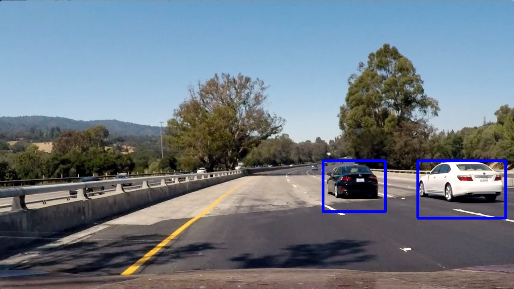

## Vehicle Detection Project

The goals / steps of this project are the following:

* Perform a Histogram of Oriented Gradients (HOG) feature extraction on a labeled training set of images and train a classifier Linear SVM classifier
* Apply a color transform and append binned color features, as well as histograms of color, to your HOG feature vector. 
* Normalize features and randomize a selection for training and testing.
* Implement a sliding-window technique and use trained classifier to search for vehicles in images.
* Run pipeline on a video stream and create a heat map of recurring detections frame by frame to reject outliers and follow detected vehicles.
* Estimate a bounding box for vehicles detected.


## Rubric Points
###Here I will consider the rubric points individually and describe how I addressed each point in my implementation.  

---
###Writeup / README

####1. Provide a Writeup / README that includes all the rubric points and how you addressed each one.   

You're reading it!

###Histogram of Oriented Gradients (HOG)

####1. Explain how (and identify where in your code) you extracted HOG features from the training images.

The code for this step is contained in the seventh code cell of the IPython notebook: `P5.ipynb`.

* The code starts by importing required libraries.
* A random image from each of vehicle and non-vehicle groups has been shown. (Visualize a Car and a Not-car)


* The next cell is a function to extract spatial bin color features
* Visualized Car and None-car spatial binning.


* Color histogram features are extracted and visualized afterwards.


* Histogram of Oriented Gradients (HOG) features are finally extracted. Here is an example of one of each of the `vehicle` and `non-vehicle` classes (Visualize Car and None-car HOG)


* I explored different color spaces (Color conversion) and compared different color spaces for car and not-car images:


* Then I checked different `skimage.hog()` parameters (`orientations`, `pixels_per_cell`, and `cells_per_block`) for various color spaces. Here is an example using the `YCrCb` color space and HOG parameters of `orientations=9`, `pixels_per_cell=(8, 8)` and `cells_per_block=(2, 2)`:


####2. Explain how you settled on your final choice of HOG parameters.

I tried various combinations of parameters. Using a random single image, the feature are extracted (Single image feature extraction) and compared. I even tried different parameters to check the performance of the classifer. **To balance the trade-off between speed and accuracy, I ended up using the following parameters:**

```python
color_space = 'YCrCb' # Can be RGB, HSV, LUV, HLS, YUV, YCrCb
orient = 9  # HOG orientations
pix_per_cell = 8 # HOG pixels per cell
cell_per_block = 2 # HOG cells per block
hog_channel = "ALL" # Can be 0, 1, 2, or "ALL"
spatial_size = (32, 32) # Spatial binning dimensions
hist_bins = 32    # Number of histogram bins
spatial_feat = True # Spatial features on or off
hist_feat = True # Histogram features on or off
hog_feat = True # HOG features on or off
ystart = 400 # Crop the road portion of the image
ystop = 656 # Crop the road portion of the image
scales = [1, 1.5, 2.0] # find different size of cars in the image
```
####3. Describe how (and identify where in your code) you trained a classifier using your selected HOG features (and color features if you used them).

*  By reading in all the `vehicle` and `non-vehicle` images and extracting their features (`extract_features()`): _spatial features, histogram features, and hog features_ I trained a linear SVM.
 
* Here is a visualization of all features a Car and a Not-car (not scaled)


* Then I normalized features for each image and split train and test with a $0.2$ split factor.

* Here is a visualization of normalized features


* The accuracy of the Linear SVM was always mor ethan $98$% for different random training.

###Sliding Window Search

####1. Describe how (and identify where in your code) you implemented a sliding window search.  How did you decide what scales to search and how much to overlap windows?

I used a single function that extracts all features,, uses a sliding-window technique over HOG sub-sampling which moves block by block over the extracted HOG channels to search for vehicles in images,  and uses the trained classifier to detect vehicles: **`find_cars()`** There are two main parameters to for this function:

* The `scale` parameter specifies the size of the sliding window (scale $1.0$ is $64\times64$ pixels window).
* `cells_per_step` defines how many cells to step including overlaps between cells. This paramter greatly affects the performace.

* Here is an example of searched area for a sliding-window with `scale=1.5` and `cells_per_step=1`


* Using single scale of $1.5$, here is a sample output:


* Ultimately, I searched on three scales $[1.0, 1.5, 2.0]$ using YCrCb 3-channel HOG features plus spatially binned color and histograms of color in the feature vector, which will provide a nice result after filtering.  Here are some example images:


####2. Show some examples of test images to demonstrate how your pipeline is working.  What did you do to optimize the performance of your classifier?

* In the final pipeline: **`find_cars_pipeline()`** I create a heatmap of found boxes form `find_cars()` function to eliminate multiple detections and false positives by adding  1 for all pixels inside each box.

* Then I threshold the heatmap to remove false positives $Threshold = 2$.
 
* Final boxes are found from heatmap using label function.

* I draw the final labels on the image.

* Here is the corresponding heatmap and the output of `scipy.ndimage.measurements.label()` on the integrated heatmap of the above test image:


* Final boxes:


* Here the resulting bounding boxes are drawn onto the six text frame after applying the heatmap filtering: 





---

### Video Implementation

####1. Describe how (and identify where in your code) you implemented some kind of filter for false positives and some method for combining overlapping bounding boxes.

In addition to what already explained in the previous section, I used the final boxes of prevous frame and created a heatmap with values of $1$ to guide the next frame. 

####2. Provide a link to your final video output.  
<video width="960" height="540" controls>
  <source src="project_output.mp4">
</video>

---

###Discussion

####1. Briefly discuss any problems / issues you faced in your implementation of this project.  Where will your pipeline likely fail?  What could you do to make it more robust?

Here I'll talk about the approach I took, what techniques I used, what worked and why, where the pipeline might fail and how I might improve it if I were going to pursue this project further. 

* Based on what I experiment, applying different color conversions change the desicion point of the SVM classifier. For instance, using `HSV`gives the color features more leverage over other features, while `YCrCb` increase the chance of HOG features. 

* To get the best results out of classifier I ended up using all available features. However, I think it is possible to optimize the number of features without loosing accuracy. For example, using only one HOG channel.

* The `scale` and `block_per_step` parameters have the most significant effect on the speed of the code. However, since I wanted to get the most correct detections, I tweaked these parameters for best detection. However, 2` scales` of $[1, 1.5]$ and `block_per_step`$=2$ will give comparable results with a bit more false positives.

---
## Review
To see some ideas on using deep learning to detect vehicles, [read this post on the U-Net architecture](https://chatbotslife.com/small-u-net-for-vehicle-detection-9eec216f9fd6). And for some inspiration to try combining this project and the advanced lane finding pipeline, [check out this video](https://www.youtube.com/watch?v=Fi9j5cr_qEk).

- Explanation given for methods used to extract HOG features, including which color space was chosen, which HOG parameters (orientations, pixels_per_cell, cells_per_block), and why.
	* Nice job discussing how you arrived at your HOG parameters by experimenting with different combinations, and it's great you also outputted examples of images and their HOG features. To enhance the discussion you could also include some documentation of any training results you obtained with the parameter settings you experimented with. (e.g., a [markdown table](https://github.com/adam-p/markdown-here/wiki/Markdown-Cheatsheet#tables) of settings and prediction accuracy obtained)

- The HOG features extracted from the training data have been used to train a classifier, could be SVM, Decision Tree or other. Features should be scaled to zero mean and unit variance before training the classifier.
	* Good description of how you trained the linear SVC with the [extracted HOG features](http://www.pyimagesearch.com/2014/11/10/histogram-oriented-gradients-object-detection/) and additional color features.

	* Suggestions: To improve the model's accuracy, you could also try a [grid search](http://scikit-learn.org/stable/modules/grid_search.html) to optimize the SVC's [C parameter](http://stats.stackexchange.com/questions/31066/what-is-the-influence-of-c-in-svms-with-linear-kernel).
To reduce the feature dimensionality and help speed up the pipeline, you can consider removing the color histogram features — many students are able to exclude them and still get good results.

- A sliding window approach has been implemented, where overlapping tiles in each test image are classified as vehicle or non-vehicle. Some justification has been given for the particular implementation chosen.
	* Nice work implementing the [sliding window search](http://www.pyimagesearch.com/2015/03/23/sliding-windows-for-object-detection-with-python-and-opencv/), and describing your solution of subsampling 2 scales of the whole image HOG extraction.

- Some discussion is given around how you improved the reliability of the classifier i.e., fewer false positives and more reliable car detections (this could be things like choice of feature vector, thresholding the decision function, hard negative mining etc.)
	* Good job optimizing the performance of the classifier with your chosen feature vector, sliding window settings, and heatmap thresholding.

	* To help reduce false positives, other ideas you could try include: 
		1. Using the [LinearSVC](http://scikit-learn.org/stable/modules/generated/sklearn.svm.LinearSVC.html) built-in [decision_function](http://scikit-learn.org/stable/modules/generated/sklearn.svm.LinearSVC.html#sklearn.svm.LinearSVC.decision_function) method, which returns a confidence score based on how far a data point is from the decision boundary — higher values equate to higher confidence predictions that can be thresholded.
		2. Augment the training with [hard negative mining](https://www.reddit.com/r/computervision/comments/2ggc5l/what_is_hard_negative_mining_and_how_is_it/).
		
- Discussion includes some consideration of problems/issues faced, what could be improved about their algorithm/pipeline, and what hypothetical cases would cause their pipeline to fail.
	* Good discussion of the issues you faced with the color spaces, feature vector, and sliding window settings.

	1. For improved speed performance in extracting HOG features, you could also try using cv2.HOGDescriptor (read more below):
http://stackoverflow.com/questions/28390614/opencv-hogdescripter-python
	2. For additional ideas on performing vehicle detection, you can read about using [Haar Cascades](https://github.com/andrewssobral/vehicle_detection_haarcascades).
